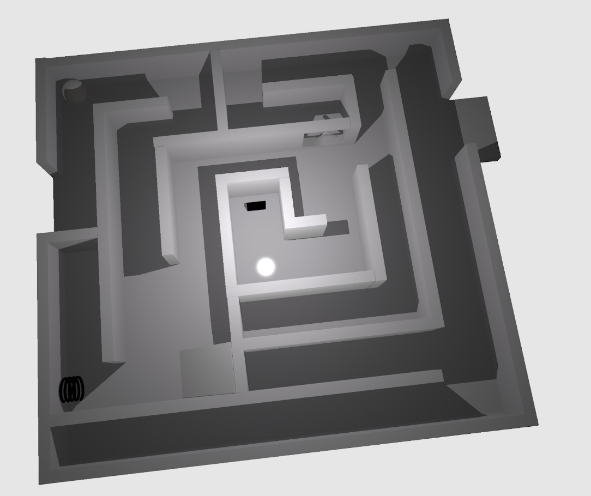

# 3D Maze Game

A 3D maze game built with Vulkan.



## Features
- 3D maze navigation
- Physics-based ball movement
- Spring mechanics
- Shield collection
- Fan interaction

## Requirements
- Vulkan SDK
- CMake
- C++17 compatible compiler

## Building
```bash
mkdir build
cd build
cmake ..
make
```

## Controls
- WASD: Tilt maze
- Q: Use spring
- Mouse: Camera control

This project is a 3D maze puzzle game where players control a rolling ball to navigate through a visually rich and interactive maze environment. Built using pure C++ and Vulkan, the game features:

Real-time ray tracing for accurate lighting and reflections

A custom-built physics engine for realistic ball movement

Interactive elements such as spring, wind zones, and shield

Maze and sphere models created with Blender

Puzzle mechanics that combine physics with logic and spatial reasoning

The game aims to blend technical graphics programming with creative gameplay design.